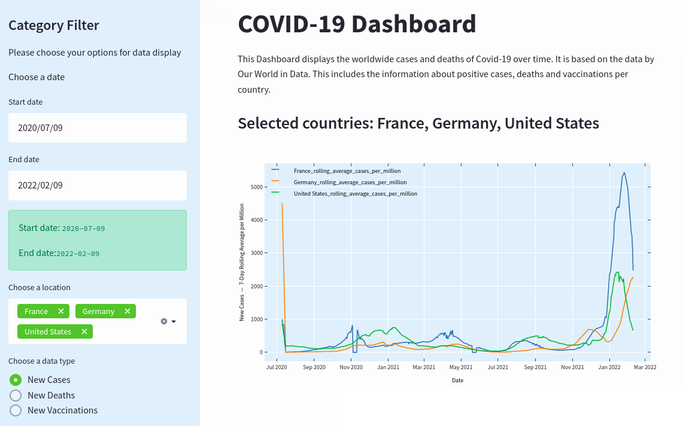

# Project-Dashboard-Covid

## Description

This project repository contains the description, tools and instructions to replicate our dashboard with information about Covid-19. You can check the deployed dashboard [here](https://share.streamlit.io/naimazhusupova/project-dashboard-covid/main/plot_data.py) (Streamlit Cloud).

## Dataset Source

For this dashboard we use Streamlit for the vizualization based on the dataset [COVID-19 Dataset by Our World in Data](https://github.com/owid/covid-19-data/blob/master/public/data/README.md), which is a collection of the COVID-19 data maintained by 'Our World in Data' team. According to its website, the variables come from:

- **Confirmed cases and deaths:** the data comes from the COVID-19 Data Repository by the Center for Systems Science and Engineering (CSSE) at Johns Hopkins University (JHU). The cases & deaths dataset is updated daily.

- **Vaccinations against COVID-19:** this data is collected by the _Our World in Data_ team from official reports.

- **Other variables:** this data is collected from a variety of sources (United Nations, World Bank, Global Burden of Disease, Blavatnik School of Government, etc.). 

## Interaction and Visualization

Our dashboard is interactive and allows the user to:

1. Select which countries to display (among a pre-defined list).
2. Select which time period to display (i.e. user could choose start and finish dates).
3. Select which variable(s) to display: number / cumulated number / 7-day rolling average of confirmed cases / deaths / (recovered).
4. Select to show the peak when cumulated number was chossen.

## Cloning and Installing Dependencies

Instead of installing every package manually we created a requirements.txt file and by running it once, all the necessary packages will be installed.

Follow the next steps in order to install all required dependencies (e.g. Pandas, Matplotlib, Streamlit, ...):

### Part 1: Installing Anaconda
1. If you do not have Anaconda, install it on your computer in accordance with your operating system
2. You can find the instructions [here]( https://docs.anaconda.com/anaconda/install/) based on your operating system

### Part 2: Creating virtual environment and activate it (using Anaconda Navigator)
1. Open Anaconda Navigator
2. Create new environment based on the settings:
    - Click on Environments
    - Click on 'Create'
    - Name an environment (for example: My_Environment)
    - Choose Python version 3.8.12
    - Click 'Create'
3. To activate the environment: click on the created environment (click on the play-icon button and choose "Open Terminal")
4. Choose 'Open Terminal' and continue with Part 3

### Part 2: Creating virtual environment and activate it (using Anaconda Prompt)
1. Open Anaconda Prompt
2. Create new environment writing: `conda create -n My_Environment python=3.8.12`
3. To activate the environment: `conda activate My_Environment`
4. Stay in the Terminal and continue with Part 3

### Part 3: Cloning and installing dependencies
1. After Part 2, go to the opened Terminal
2. Move to the directory where you want to clone this repo. So, write in the terminal: `cd /<any_folder>/`
3. Clone the respository using the following command in the terminal: `git clone git@github.com:naimazhusupova/Project-Dashboard-Covid.git`
4. Move to the folder of the cloned repo `cd /.../Project-Dashboard-Covid` (where you cloned this repo) command, e.g. `cd /Users/nazgul/Desktop/Project-Dashboard-Covid`
5. Install the dependencies by writing in the Terminal: `pip install -r requirements.txt` (this .txt file is provided in this repo)

Note:
In the 'requirements.txt' packages as pip and others are not included, because they are installed by default when you create a new environment using Anaconda. In any case you can check if they are installed properly:
1. Go to Anaconda Navigator
2. Go to your environment
3. Choose in the drop-down menu 'Installed'
4. Search for the required packages

## Run the dashboard locally (using Anaconda Navigator)

1. Open Anaconda Navigator
2. Activate your environment by: choosing a created environment (My_Environment) and open the terminal in your created environment (click on the play-icon button and choose "Open Terminal")
4. Move to your directory using `cd your_directory` (where you cloned this repo) command, for example `cd /Users/nazgul/Desktop/Project-Dashboard-Covid`
5. Write the following command `streamlit run plot_data.py`
6. Finally, the dashboard will be automatically displayed in your default browser

## Run the dashboard locally (using Anaconda Prompt)

1. Open Anaconda Prompt
2. Activate your environment by: `conda activate My_Environment`
3. Open the terminal in your created environment (click on the play-icon button and choose "Open Terminal")
4. Move to your directory using `cd your_directory` (where you cloned this repo) command, for example `cd /Users/nazgul/Desktop/Project-Dashboard-Covid`
5. Write the following command `streamlit run plot_data.py`
6. Finally, the dashboard will be automatically displayed in your default browser

## Authors

- **Eva Elbing** <eva.elbing@cri-paris.org>

- **Dennis Nunez** <dennis.nunez@cri-paris.org>

- **Naima Zhusupova** <naima.zhusupova@cri-paris.org>

## References

- [Streamlit Website](https://streamlit.io/)

- [Data on COVID-19 (coronavirus) by Our World in Data](https://github.com/owid/covid-19-data/blob/master/public/data/README.md)

- [Quickly Build and Deploy a Dashboard with Streamlit](https://towardsdatascience.com/quickly-build-and-deploy-an-application-with-streamlit-988ca08c7e83)

- [Build Web App instantly for Machine Learning using Streamlit](https://www.analyticsvidhya.com/blog/2021/06/build-web-app-instantly-for-machine-learning-using-streamlit/)

- [Build Web App instantly for Machine Learning using Streamlit](https://www.geeksforgeeks.org/a-beginners-guide-to-streamlit/)

